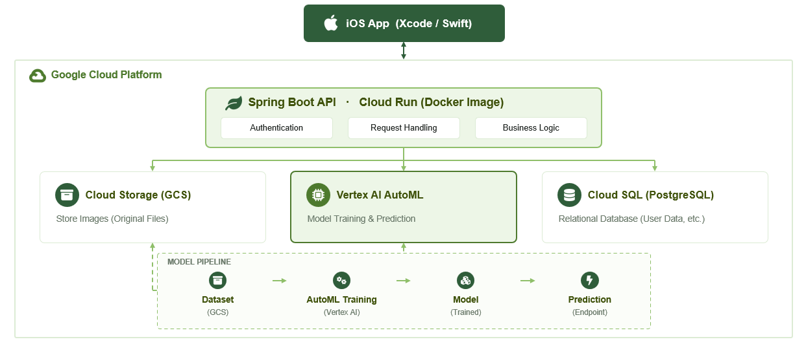

# 🥑 D-avocado

> AI-powered avocado ripeness tracking platform.

D-avocado is an end-to-end platform that predicts avocado ripeness from a single photo and estimates the remaining days until the user's preferred ripeness stage (D-day).

The project is built with a native iOS application, a Spring Boot backend, and an AI inference service deployed on Google Cloud Platform.

---

## 📖 Overview

D-avocado provides a complete workflow for avocado ripeness management.

Users can photograph an avocado, receive an AI-based ripeness prediction, estimate the remaining days until their preferred ripeness stage, and track their scans over time.

### Key Features

- 📷 Photo-based avocado ripeness prediction
- 🥑 Five-stage ripeness classification
- 📅 Personalized D-day estimation
- 📊 Scan history management
- ☁️ Cloud-native AI inference service

---

## 🏗️ System Architecture

> *(Architecture diagram will be added here.)*

<p align="center">

</p>

---

## 📂 Project Repositories

| Repository | Description |
|------------|-------------|
| **d-avocado** | Project documentation and overall architecture |
| **davocado-frontend** | SwiftUI iOS application |
| **davocado-backend** | Spring Boot REST API |
| **d-avocado-ripeness-mlops** | AI inference server and MLOps pipeline |

---

## ⚙️ Technology Stack

### Mobile

- SwiftUI
- MVVM

### Backend

- Java 21
- Spring Boot
- PostgreSQL
- JWT Authentication

### AI / Machine Learning

- Python
- PyTorch
- ResNet-18
- OpenCV
- Segment Anything Model (SAM)

### Cloud

- Google Cloud Platform
- Cloud Run
- Cloud SQL
- Cloud Storage
- Artifact Registry
- Cloud Build

---

## 🚀 End-to-End Workflow

```text
Take Photo
      │
      ▼
Upload Image
      │
      ▼
Backend API
      │
      ▼
Inference Preprocessing
      │
      ▼
AI Inference Service
      │
      ▼
Ripeness Prediction
      │
      ▼
Save Scan History
      │
      ▼
Return D-Day Result
```

---

## 📚 Documentation

```
docs/
├── PRD.md
├── Architecture.md
├── API.md
├── Deployment.md
├── Database.md
└── images/
```

| Document | Description |
|----------|-------------|
| **PRD.md** | Product Requirements Document |
| **Architecture.md** | System architecture |
| **API.md** | Backend API specification |
| **Deployment.md** | Google Cloud deployment guide |
| **Database.md** | Database schema and design |

---

## 📁 Repository Structure

```
d-avocado
│
├── README.md
├── docs/
│   ├── PRD.md
│   ├── Architecture.md
│   ├── API.md
│   ├── Deployment.md
│   ├── Database.md
│   └── images/
│
├── davocado-frontend/
├── davocado-backend/
└── d-avocado-ripeness-mlops/
```

---

## ✨ Features

- User authentication
- Personalized target ripeness settings
- AI-powered ripeness prediction
- Scan history management
- Image storage with Google Cloud Storage
- Cloud-native deployment
- Modular service architecture

---

## 🔮 Roadmap

- [x] iOS Application
- [x] Backend API
- [x] AI Inference Service
- [x] Google Cloud Deployment
- [ ] Push notification scheduling
- [ ] Model monitoring
- [ ] CI/CD automation
- [ ] Continuous model retraining
- [ ] Explainable AI visualization

---

## 👥 Team

| Role | Repository |
|------|------------|
| Mobile | `davocado-frontend` |
| Backend | `davocado-backend` |
| AI / MLOps | `d-avocado-ripeness-mlops` |

---
